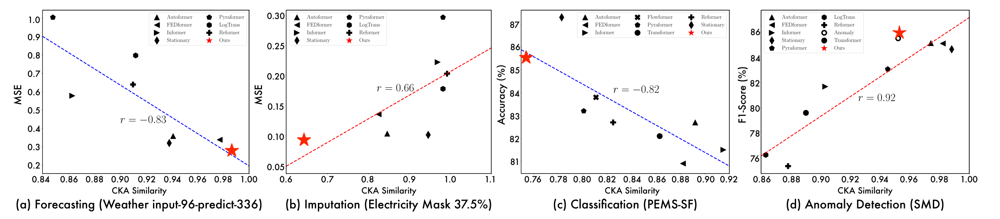

Paper：[TimesNet: Temporal 2D-Variation Modeling for General Time Series Analysis](https://arxiv.org/abs/2210.02186) 

Code：[thuml/TimesNet](https://github.com/thuml/TimesNet)

## 1. Motivation

不同于 NLP 中每个单词都具有相对丰富的语义信息，时序中时间戳级的数据能够表示的信息比较信息，关键信息往往保存在连续的**时序变化（Temporal Variation）**中，因此，建模时序变化是各类时序分析任务的核心。在现有基于深度模型的方法中，RNN 和 TCN 类的网络聚焦于捕获邻近时刻间的变化而缺乏长期依赖建模的能力，Transformer 类方法具有长期依赖建模的优势，但分散在时间戳级数据间的注意力难以挖掘出时序变化的关键信息。

文章从一个新的视角——时序的**多周期性（Multi-periodicity）**——切入来建模时序变化，如上图所示，主要基于如下两点观察：
- 真实世界的时序数据通常可以看成是多个周期分量叠加的结果，如交通、天气等数据具有年、月、日级的周期；
- 针对某一具体的周期分量，每个时间点的数据不仅与其所在周期内的邻近点相关，也与分量内其他周期的时间点数据相关，因此周期分量内往往呈现出 周期内（Intraperiod-）与周期间（Interperiod-）两种时序变化，前者对应短期内的变化过程，后者对应时序的长期变化趋势；


然而，时序数据通常为 1D 表示混杂了多个周期分量，难以从中挖掘各个周期分量的两种时序变化关系，因此，文章基于多周期分解，提出了将 1D 时序数据转换为 2D 张量表示的方法，如上图所示，2D 表示能够充分展现上述两种时序变化关系，且可以应用高效的模型来建模复杂的时序变化。

## 2. Methodology

TimesNet 由堆叠的 TimesBlock 组成，其中每个 TimesBlock 主要包括三个阶段，实现 **多周期分解 → 周期分量时序变化建模 → 自适应特征融合**：
1. 将 1D 时序分解多个特定周期的 2D 张量表示；
2. 利用高效的 2D kernel 处理 2D 时序表示；
3. 将处理后的 2D 表示重新映射回 1D 形式，并根据特定的权重融合各周期的分量

### 2.1. 1D→2D Transformation


该步骤旨在将 1D 时序数据分解为若干个 2D 张量表示，每个 2D 张量表示代表一个特定的周期分量。首先，在时间维度做快速傅里叶变换（FFT），通过各频点的幅值 $A$ 来筛选主要频率分量，也即周期分量，实现上依据幅值的大小返回 $topk$ 个频率，作为 $k$（超参数） 个主要的周期分量，这一步计算可以得到 $k$ 个频率 $f$ 和周期值 $p$；随后，基于特定的周期，可以对原始的 1D 时序做 Reshape 完成变换，该过程记为:

$$
\bold{A}=Avg(Amp(FFT(\bold{X}_{1D}))) \\\
f_1,...,f_k=topk(\bold{A}) \\\
p_1,...,p_k=\lceil \frac{T}{f_1} \rceil,...,\lceil \frac{T}{f_k} \rceil
$$

$$
\bold{X}_{2D}^i=Reshape\_{p_i,f_i}(Padding(\bold{X}\_{1D})),\  i \in \\{1,...,k\\}
$$

其中 FFT 的实现如下（数据以 ETTh1 为例）：
```python
def FFT_for_Period(x, k=2):
    # x: (B, T, C) (32, 192, 16)
    xf = torch.fft.rfft(x, dim=1) # (32, 97, 16), torch.fft.rfft()的输出仅包含奈奎斯特频率以下的正频率
    # 根据幅度值找topK频率
    frequency_list = abs(xf).mean(0).mean(-1) # batch和channel维度取均值, 留下temporal维度x, frequency_list保存了各个频点的幅值
    frequency_list[0] = 0 # 0频点幅度置为0？？
    a_list, top_list = torch.topk(frequency_list, k)
      # a_list 返回topk的幅值
      # top_list 返回k个幅度值在列表中的偏移量,偏移量代表每个时间点对应的频率f
    top_list = top_list.detach().cpu().numpy() # topK的索引
    period = x.shape[1] // top_list # p=|T|/f（此处向下取整，和文中公式有出入）
    return period, abs(xf).mean(-1)[:, top_list] # 返回主要周期列表, 以及主要频点的权重(在channel维度平均)
```

### 2.2. TimesBlock


TimesNet 由若干 TimesBlock 以残差的形式堆叠而成，对于第 $l$ 层 TimesBlock 而言，输入为 $X_{1D}^{l-1}\in \Bbb{R}^{T\times d_{model}}$，通过 Transformation 方法转化为多周期的 2D 表示，通过 2D Kernel 提取时序变化特征，最后重新变换至 1D 表示后自适应融合多周期的时序变化特征，过程简记为（$i\in \\{1,...,k\\}$）：
- 1D→2D 变换：
$$
\bold{X}\_{2D}^{l,i}=Transformation(\bold{X}\_{1D}^{l-1})
$$
- 2D kernel 提取时序变化特征（可以采用多种先进的视觉领域模型，文章实现采用经典的 Inception 模型）：
$$
\hat{\bold{X}}\_{2D}^{l,i}=Inception({\bold{X}\_{2D}^{l,i}})
$$
- 2D→1D 变换：
$$
\hat{\bold{X}}\_{1D}^{l,i}=Trunc(Reshape\_{1,(p_i\times f_i)}(\hat{\bold{X}}\_{2D}^{l,i}))
$$
- 自适应融合，根据各频点的幅值作为各周期分量加权的权重，融合各周期的时序变化特征：
$$
\hat{\bold{A}}\_{f_1}^{l-1},...,\hat{\bold{A}}\_{f_k}^{l-1}=Softmax(\bold{A}\_{f_1}^{l-1},...,\bold{A}\_{f_k}^{l-1}) \\\
\bold{X}\_{1D}^{l}=\sum_{i=1}^{k}\hat{\bold{A}}\_{f_i}^{l-1}\times \hat{\bold{X}}\_{1D}^{l,i}
$$

## 3. Experiments


文章在五个主流时序任务上做了充分的实验，同时为现有时序深度模型整理了一个基础的代码框架并维护了一个 LeaderBoard：[thuml/Time-Series-Library](https://github.com/thuml/Time-Series-Library)。



从表示学习的角度，实验发现，模型学到的表示如果在预测和异常检测任务上的表现越好，其 **CKA 相似度**越高（越低的 CKA 相似度表示在模型的不同层次中，学到的表示区别越大），而在插补和分类任务上呈现出相反的规律。这个结果展现了不同任务对数据表示属性的要求（如插补和分类任务需要层次化表征），相对于其他模型，TimesNet 能够学到更具通用性的表示。

## 4. Discussion

模型的核心在时序从 1D 至 2D 的转换，涉及到时序周期分解的过程，主要方法是 FFT + 主要频率筛选，在实现上，对于一个 shape 为 $(B,T,C)$ 的数据，在 batch 和 channel 维度上取均值，在 temporal 维度上做 FFT，唯一需要设定的参数是主要频率个数 $k$，这一步取均值的操作在多周期提取之前直接融合了多个维度的数据，这种处理是否适用于 **数据集中不同维度数据的周期相差较大** 的情况？频率换算至周期的取整操作可能导致周期计算结果重复，ETTh1 数据集上一次测试结果为 **periods=array([4, 2, 4, 2, 4]**，是否需要处理时序数据的主要频率分布较为集中的情况？

## Reference
[【游凯超】ICLR2023 | TimesNet: 时序基础模型，预测、填补、分类等五大任务全面领先](https://zhuanlan.zhihu.com/p/606575441)
[【Jajaco】论文阅读-TimesNet ICLR 2023](https://zhuanlan.zhihu.com/p/607836445)